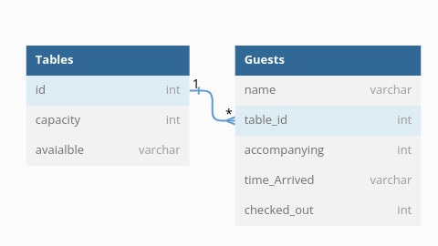

## Running the application
We added basic project skeleton with docker-compose. (optional)
Feel free to refactor but provide us with good instructions to start the application
```
make docker-up
```

Update the `docker/mysql/dump.sql` to initialize the mysql database

The docker compose consists of 2 services:
- Main back-end (BE) application in golang
- Mysql database to store data

There is a dependency between the services, the BE depends on the database to be healthy not just running

## Task description

We'd like to implement a guest-list service for the GetGround year-end party! We haven't decide on the venue yet so the number of tables and the capacity are subject to change.

When the party begins, guests will arrive with an entourage. This party may not be the size indicated on the guest list. However, if it is expected that the guest's table can accommodate the extra people, then the whole party should be let in. Otherwise, they will be turned away. Guests will also leave throughout the course of the party. Note that when a guest leaves, their accompanying guests will leave with them.

At any point in the party, we should be able to know:
- Our guests at the party
- How many empty seats there are

## Assumptions
- I have assumed that the guest name is unique, and we can't have more than one guest with the same name.
Of course this is not a real case scenario but the given API enforced me to do so, it is better to have an id and use this id along with name(email would be even better) to handle uniqueness.
- Checked in user can't check in again, checked out user can't check out again.

## Schema
This is the schema that I have used to model the task



## API
### Add table

```
POST /tables
body: 
{
    "capacity": 10
}
response: 
{
    "id": 2,
    "capacity": 10
}
```

### Add a guest to the guest-list

If there is insufficient space at the specified table, then an error should be thrown.

```
POST /guest_list/name
body: 
{
    "table": int,
    "accompanying_guests": int
}
response: 
{
    "name": "string"
}
```

### Get the guest list

```
GET /guest_list
response: 
{
    "guests": [
        {
            "name": "string",
            "table": int,
            "accompanying_guests": int
        }, ...
    ]
}
```

### Guest Arrives

A guest may arrive with an entourage that is not the size indicated at the guest list.
If the table is expected to have space for the extras, allow them to come. Otherwise, this method should throw an error.

```
PUT /guests/name
body:
{
    "accompanying_guests": int
}
response:
{
    "name": "string"
}
```

### Guest Leaves

When a guest leaves, all their accompanying guests leave as well.

```
DELETE /guests/name
response code: 204
```

### Get arrived guests

```
GET /guests
response: 
{
    "guests": [
        {
            "name": "string",
            "accompanying_guests": int,
            "time_arrived": "string"
        }
    ]
}
```

### Count number of empty seats

```
GET /seats_empty
response:
{
    "seats_empty": int
}
```

## Entrypoint
The entrypoint for the project is the main.go file in the root folder.
The main.go define a cobra command that define the modes that the app can run in, for now it is just and API mode.

The cmd/api.go file boot the API and define the server that will be used to serve the requests.

The APi boot initialise all the API dependencies (just database in our case) and initialise the repositories, services, controllers and routers.

## Testing
All the modules files are test with coverage 100% testing most if not all the scenarios.

I have used mockery to help in dependency injection and sql-mock to test sql queries.

## Things to improve
- There is always room for improvements, as already mentioned before it is better to have another identifier for the guest rather than the name, email or an id would be much better and applicable to real life cases.

- It is better to use for openApi for example to declare the APIs this would have many benefits, like being able to generate the requests from that declaration files and generating swag files.
